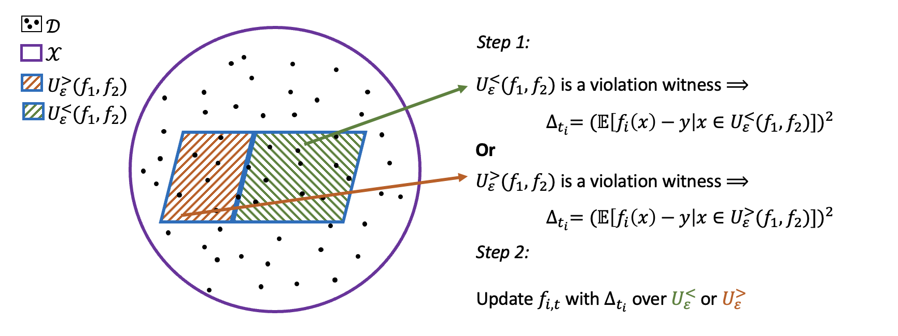
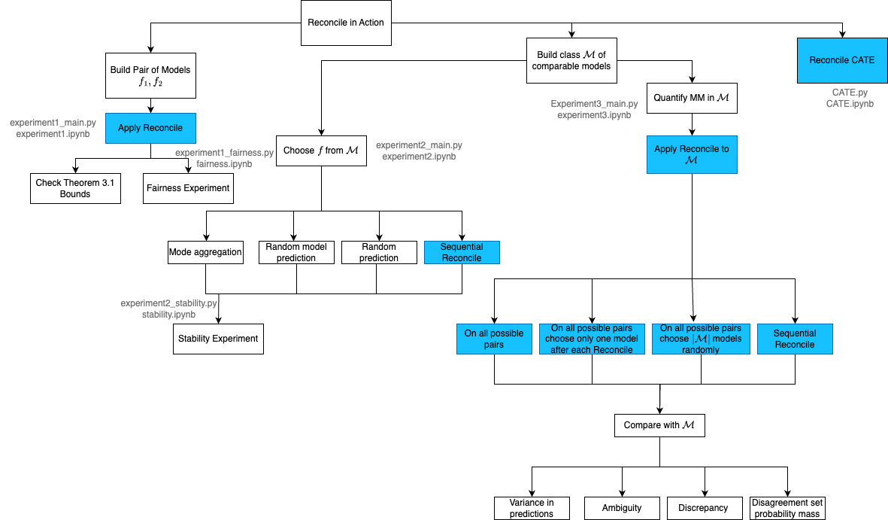

# Reconciling Predictive Multiplicity in Practice

**Tina Behzad** &nbsp;&nbsp; **Sílvia Casacuberta** &nbsp;&nbsp; **Emily Diana** &nbsp;&nbsp; **Alexander Williams Tolbert**

Many machine learning applications predict individual probabilities, such as the likelihood that a person develops a particular illness. Since these probabilities are unknown, a key question is how to address situations in which different models trained on the same dataset produce varying predictions for certain individuals. This issue is exemplified by the model multiplicity (MM) phenomenon, where a set of comparable models yield inconsistent predictions. Roth, Tolbert, and Weinstein recently introduced a reconciliation procedure, the *Reconcile algorithm*, to address this problem. Given two disagreeing models, the algorithm leverages their disagreement to falsify and improve at least one of the models.
  In this paper, we empirically analyze the Reconcile algorithm using five widely-used fairness datasets: COMPAS, Communities and Crime, Adult, Statlog (German Credit Data), and the ACS Dataset. We examine how Reconcile fits within the model multiplicity literature and compare it to existing MM solutions, demonstrating its effectiveness, including in terms of robustness and fairness. We also discuss potential improvements to the Reconcile algorithm theoretically and practically. Furthermore, we extend the Reconcile algorithm to the setting of causal inference, given that different competing estimators can again disagree on specific conditional average treatment effect (CATE) values. We present the first extension of the Reconcile algorithm in causal inference, analyze its theoretical properties, and conduct empirical tests. Our results confirm the practical effectiveness of Reconcile and its applicability across various domains.

<p align="center">
  
  <br>
  <em>Figure 1: Visualization of Reconcile Algorithm</em>
</p>

Experiment1_main.py includes the experiments for building models. Experiment_2_3_main.py includes the experiment with the sets, including the Sequential Reconcile.
main.py includes the CATE experiment.

All results from the experiments are available in the results directory and notebooks for visualizing them are in the visualization directory.

<p align="center">
  
  <br>
  <em>Figure 2: Visual representation of goals and experiments in this work. All experiments that include applying Reconcile are colored blue. The corresponding executable files are written outside the boxes.</em>
</p>

## Cite
This repository was developed as part of [our work](https://arxiv.org/pdf/2501.16549) and has been accepted in FAccT 2025. We ask that you consider citing our paper:
```
@article{behzad2025reconciling,
  title={Reconciling Predictive Multiplicity in Practice},
  author={Behzad, Tina and Casacuberta, S{\'\i}lvia and Diana, Emily Ruth and Tolbert, Alexander Williams},
  journal={arXiv preprint arXiv:2501.16549},
  year={2025}
}
```