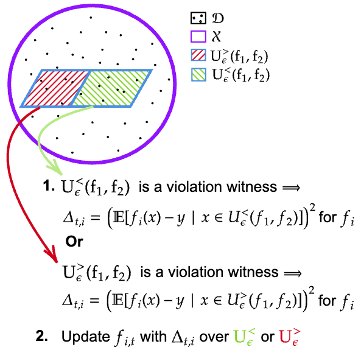
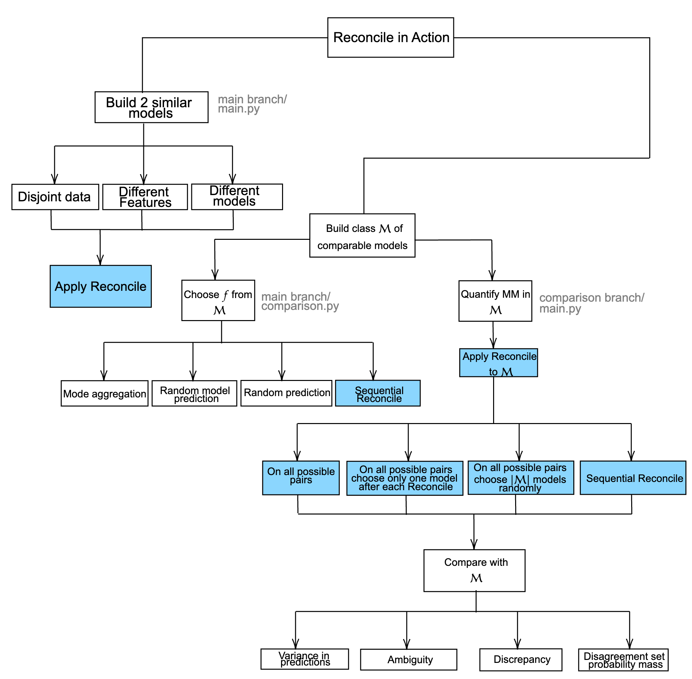

# Reconciling Predictive Multiplicity in Practice

**Tina Behzad** &nbsp;&nbsp; **Sílvia Casacuberta** &nbsp;&nbsp; **Emily Diana** &nbsp;&nbsp; **Alexander Williams Tolbert**

Many machine learning applications focus on predicting “individual probabilities”; for example, the probability that an individual develops a certain illness. Since these probabilities are inherently unknowable, a fundamental question that arises is how to resolve the (common) scenario where different models trained on the same dataset obtain different predictions on certain individuals. A well-known instance of this problem is the so-called model multiplicity (MM) phenomenon, in which a collection of comparable models present inconsistent predictions. Recently, Roth, Tolbert, and Weinstein proposed a reconciliation procedure (called the Reconcile algorithm) as a solution to this problem: given two disagreeing models, they show how this disagreement can be leveraged to falsify and improve at least one of the two models. In this paper, we perform an empirical analysis of the Reconcile algorithm on three well-known fairness datasets: COMPAS, Communities and Crime, and Adult. We clarify how Reconcile fits within the model multiplicity literature, and compare it to the main solutions proposed in the MM setting, demonstrating the efficacy of the Reconcile algorithm. Lastly, we demonstrate ways of improving the Reconcile algorithm in theory and in practice.

  
   
  <em>Figure 1: Visualization of Reconcile Algorithm</em>

The main branch includes the pipeline for running Reconcile. The pipeline consists of:
1. Finding similar models with significant disagreements.
2. Running Reconcile.

In the main branch, `comparison.py` includes experiments for comparing Reconcile with methods suggested in section 6 from "Model multiplicity: Opportunities, concerns, and solutions" (Black, Raghavan, and Barocas 2022). These experiments focus on choosing one model from the set of models with similar accuracy.

The comparison branch includes experiments on quantifying the severity of predictive multiplicity in a set.

  
   
  <em>Figure 2: Visual representation of goals and experiments in this work. All experiments that include applying Reconcile are colored blue. The corresponding executable files are written outside the boxes.</em>

